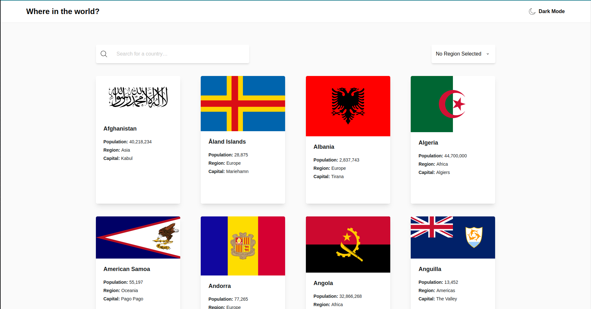

# Frontend Mentor - REST Countries API with color theme switcher solution

This is a solution to the [REST Countries API with color theme switcher challenge on Frontend Mentor](https://www.frontendmentor.io/challenges/rest-countries-api-with-color-theme-switcher-5cacc469fec04111f7b848ca). Frontend Mentor challenges help you improve your coding skills by building realistic projects.

## Table of contents

- [Overview](#overview)
  - [The challenge](#the-challenge)
  - [Screenshot](#screenshot)
  - [Links](#links)
- [My process](#my-process)
  - [Built with](#built-with)
  - [What I learned](#what-i-learned)
  - [Useful resources](#useful-resources)
- [Author](#author)

## Overview

### The challenge

Users should be able to:

- See all countries from the API on the homepage
- Search for a country using an `input` field
- Filter countries by region
- Click on a country to see more detailed information on a separate page
- Click through to the border countries on the detail page
- Toggle the color scheme between light and dark mode _(optional)_

### Screenshot

### Links

- Live Site URL: [https://rest-countries-api-with-color-theme-switcher-achiewe.vercel.app/]

## My process

### Built with

- Semantic HTML5 markup
- CSS custom properties
- Flexbox
- Mobile-first workflow
- [React](https://reactjs.org/) - JS library
- [Zustand](https://www.npmjs.com/package/zustand) - State Managment
- [tailwind](https://tailwindcss.com/) - For styles

### What I learned

in a given project, the Rest Countries API with Color Theme Switcher, developed using React.js, TypeScript, and Zustand, i obtain valuable insights, deepened understanding of react.js for component-based development, state management, and routing with React Router. i use Zustand to simplify state handling in the React context, resulting in improved performance. implemented visual customization options using css variables and dynamic theming. increase skills in data manipulation and algorithmic thinking. structured project for improved code organization, readability, and maintenance.

### Useful resources

- (https://stackoverflow.com/) - this resource provided a solution for resolving a specific coding issue i encountered in my project. i found the explanation clear and the suggested pattern highly effective..

- (https://www.figma.com/) - i utilize Figma as my primary design tool for crafting projects, leveraging its intuitive interface and collaborative features.

## Author

- Github - [achiewe](https://github.com/achiewe)
- LinkedIn - [achi mamukashvili](https://www.linkedin.com/in/achi-mamukashvili-721928263/)
